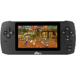

# Ritmix RZX-50

  
|Component|Description                         |
|---------|------------------------------------|
|CPU      |Ingenic JZ4755 400MHz               |
|RAM      |64MB                                |
|Storage  |4GB                                 |
|Screen   |4.3" 480x272                        |
|Slot     |MicroSD                             |
|Gamepad  |DPad, 4 Buttons, Start, Select, L, R|
|USB      |Client                              |
|Battery  |3.7V 1800mA                         |
|Dimension|182mm x 80mm x 15mm                 |
|Weight   |192g                                |

### https://steward-fu.github.io/website/index.htm
